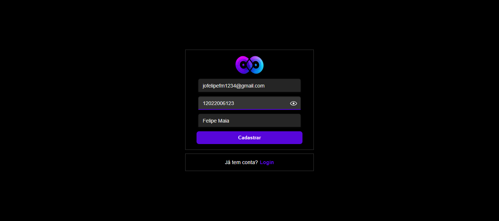
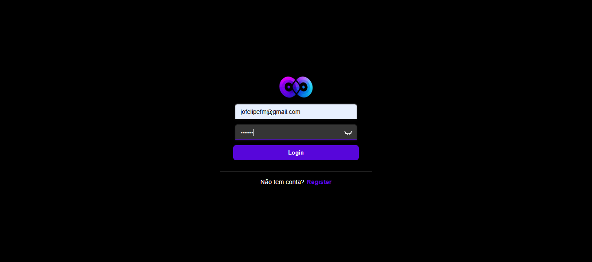
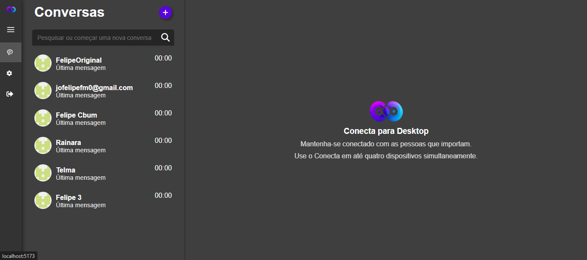
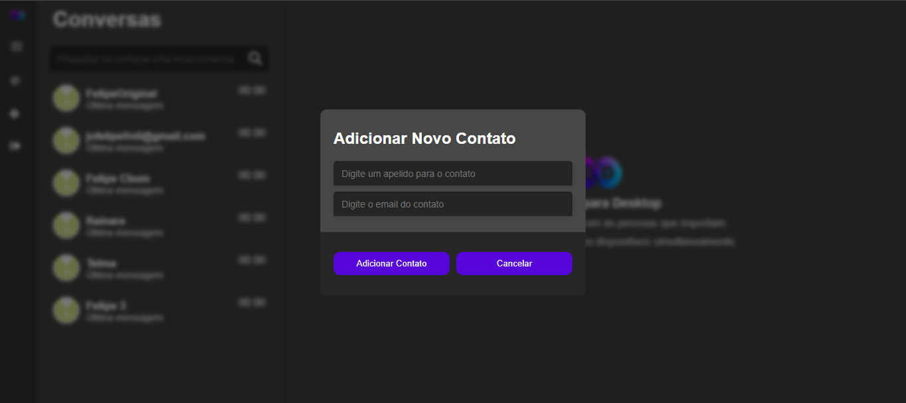

# Conecta

Conecta é uma aplicação moderna de troca de mensagens desenvolvida para facilitar a comunicação entre usuários de maneira prática e segura. Ideal para comunidades, grupos de trabalho e conexões pessoais, a plataforma prioriza a simplicidade e a eficiência.

## Status
🚧 Projeto Finalizado (possiveis mudanças no futuro) 🚧

## Pré-visualização
Confira uma prévia do Conecta:








---

## Principais Funcionalidades
- ✅ Sistema de autenticação seguro (JWT).
- ✅ Pesquisa de contatos.
- ✅ Envio e recebimento de mensagens em tempo real.
- ✅ Criação de contas e gerenciamento de perfis de usuário.
- ✅ Design responsivo para dispositivos móveis e desktops.

---

## Tecnologias Utilizadas
- **Frontend:** React.js
- **Backend:** Node.js com Express
- **Banco de Dados:** MySQL
- **WebSocket:** Socket.IO para comunicação em tempo real
- **Autenticação:** JWT (JSON Web Tokens)

---

## Como Começar

### Pré-requisitos
Certifique-se de ter instalado:
- **Node.js** (v16 ou superior)
- **MySQL**
- **Git**

### Criação do Banco de Dados

#### BD `conecta`
Cria o BD do projeto.
```bash
CREATE DATABASE conecta;
```

#### Tabela `users`
Guarda informações sobre os usuários.
```bash
CREATE TABLE users (
    id INT AUTO_INCREMENT PRIMARY KEY,
    name VARCHAR(100) NOT NULL,
    email VARCHAR(100) UNIQUE NOT NULL,
    password VARCHAR(255) NOT NULL,
    created_at TIMESTAMP DEFAULT CURRENT_TIMESTAMP
);
```

#### Tabela `contacts`
Relaciona usuários e seus contatos.
```bash
CREATE TABLE contacts (
    id INT AUTO_INCREMENT PRIMARY KEY,
    user_id INT NOT NULL,
    contact_user_id INT NOT NULL,
    created_at TIMESTAMP DEFAULT CURRENT_TIMESTAMP,
    FOREIGN KEY (user_id) REFERENCES users(id),
    FOREIGN KEY (contact_user_id) REFERENCES users(id),
    UNIQUE(user_id, contact_user_id)            
);
```

#### Tabela `messages`
Armazena as mensagens enviadas entre os contatos.
```bash
CREATE TABLE messages (
    id INT AUTO_INCREMENT PRIMARY KEY,
    sender_id INT NOT NULL,
    receiver_id INT NOT NULL,
    content TEXT NOT NULL,
    is_read TINYINT(1) DEFAULT 0,
    sent_at TIMESTAMP DEFAULT CURRENT_TIMESTAMP,
    FOREIGN KEY (sender_id) REFERENCES users(id),
    FOREIGN KEY (receiver_id) REFERENCES users(id)
);
```

#### Tabela `conversations`
A tabela conversations será útil para identificar diferentes conversas entre usuários.
```bash
CREATE TABLE conversations (
    id INT AUTO_INCREMENT PRIMARY KEY,
    user_one_id INT NOT NULL,
    user_two_id INT NOT NULL,
    created_at TIMESTAMP DEFAULT CURRENT_TIMESTAMP,
    FOREIGN KEY (user_one_id) REFERENCES users(id),
    FOREIGN KEY (user_two_id) REFERENCES users(id),
    UNIQUE(user_one_id, user_two_id)
);
```

### Instalação

1. Clone o repositório:
    ```bash
    git clone https://github.com/fel1pee3/conecta.git
    cd conecta
    ```

2. Instale as dependências do backend:
    ```bash
    cd backend
    npm install
    ```

3. Configure o arquivo `.env` no backend:
    ```env
    DB_HOST="localhost"
    DB_USER="root"
    DB_PASSWORD="SUA-SENHA"
    DB_DATABASE="conecta"
    PORT=3000
    JWT_KEY="SUA-CHAVE-JWT"
    ```

4. Inicie o backend:
    ```bash
    npm start
    ```

5. Instale as dependências do frontend:
    ```bash
    cd ../frontend
    npm install
    ```

6. Inicie o frontend:
    ```bash
    npm run dev
    ```

7. Acesse a aplicação em `http://localhost:3000`.

---

## Licença
Este projeto está licenciado sob a licença **MIT**.
